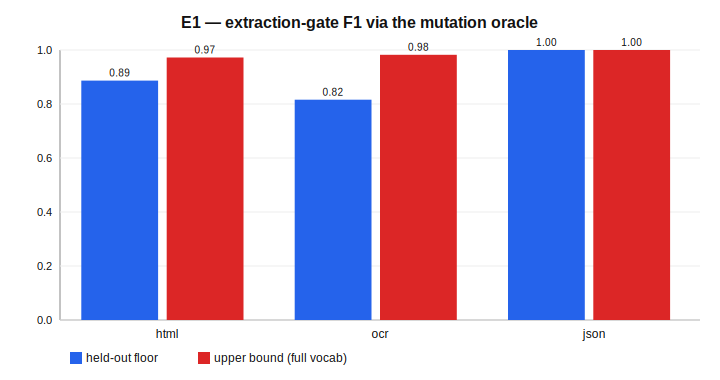
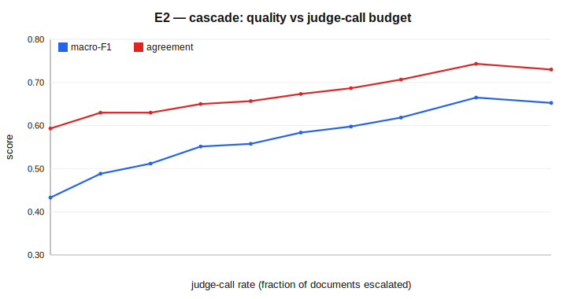
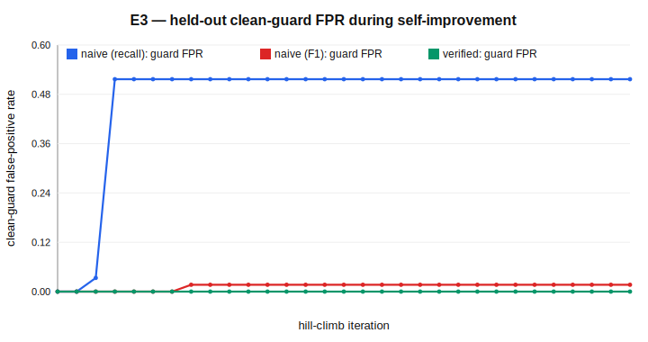
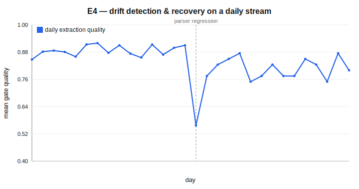
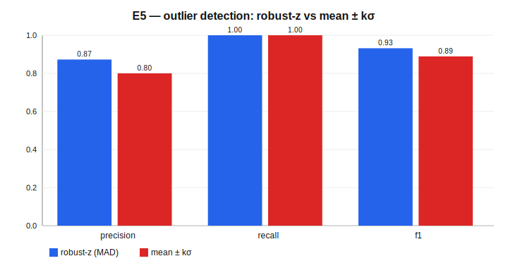
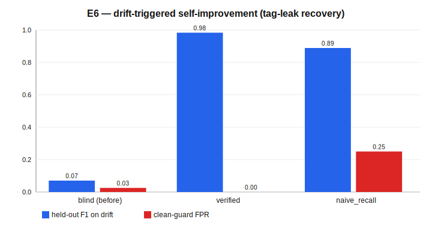
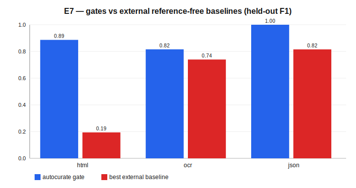

# AutoCurate: An AI-Native, Self-Verifying Operating Loop for Pretraining-Data Curation

**Xiang "Tony" Cao**
Independent Researcher · caoxiang828@gmail.com

---

## Abstract

Pretraining-data curation is usually shipped as a one-shot filter, but in
practice it is a *standing process*: a crawler runs every day, its sources
drift, its extractors silently regress, and the curation policy must keep
justifying what it keeps. We present `autocurate`, a small, dependency-free
reference implementation that turns a four-direction data-governance theory —
*traceable sources, assessable quality, graded risk, divisible responsibility* —
into a runnable, **self-verifying, self-improving** operating loop. Cheap
reference-free extraction gates (HTML / OCR / JSON) auto-decide the easy cases
and escalate only an ambiguous middle band to an LLM-as-Judge, reusing the
sibling `judgecurate` package unchanged for semantic adjudication. The
scientific core is a **mutation-oracle verification harness**: it corrupts clean
documents with *known* defects and measures recovery, so every gate, threshold,
and capability is scored *without human labels*; **held-out corruption
vocabularies** force generalization over read-back. A **verified hill-climber**
then improves the gates, adopting a change only if it passes that oracle on
disjoint held-out documents without regressing a clean guard set. We do not
claim state-of-the-art filtering and we train no language model. Instead, on
deterministic, CPU-only synthetic corpora we *characterize the mechanism*: the
two *hard* reference-free gates (HTML, OCR) reach a 0.85 held-out-floor F1 (0.98
upper bound) at catching injected defects, with a JSON structural gate perfect
and reported separately (E1); a cheap router that escalates only the uncertain
middle to `judgecurate`'s offline judge recovers ~69% of the judge's macro-F1
gain at half the judge calls (E2); an **un-guarded recall objective
reward-hacks — destroying 52% of held-out clean data** — and the explicit guard
clause delivers a hard *zero* false-positive guarantee that an un-guarded
balanced objective cannot promise (E3); a statistical-process-control monitor
detects an injected parser regression with **zero-day latency across 8 streams**
(0.13 false alarms/stream) (E4); and, when that regression starts leaking raw
HTML tags, a verified hill-climb **adapts a blind gate's detection F1 from 0.07
to 0.98** while a naive control over-flags (E6). The gates also beat every
external reference-free baseline — Gopher, Alex & Burns, gzip, parse-only — on
the same oracle (E7). Every number is reproduced by committed tests, and every
equation is bound to a function — an honest, auditable floor that a real LLM
judge and a real extractor can only raise.

**Keywords:** pretraining-data curation; data governance; reference-free quality
estimation; verifiable rewards; self-improvement; reward hacking; AI-native.

---

## 1. Introduction

The leverage in a modern training pipeline is in the data, and most of the
*tooling* in the data is one-shot: a corpus is filtered once, by a fixed
function — Gopher/C4 heuristics, a FineWeb-Edu classifier, a DCLM fastText filter
— and then frozen. But a production crawl is not a one-shot object. New shards
arrive daily; an upstream HTML extractor ships a regression and starts leaking
nav bars; an OCR engine update mangles a font; a partner's JSONL feed begins
truncating records. None of this is visible to a static quality classifier,
which will happily score the *content* of a document whose *extraction* already
destroyed it. Curation in the AI-native paradigm is therefore better understood
as an **operating loop** that must continuously (i) trace where data came from,
(ii) assess whether it is usable, (iii) grade its risk, and (iv) attribute
responsibility for each decision — and, crucially, **improve its own
capabilities** as the corpus shifts.

A recent governance framework names exactly these four directions — *traceable
sources, assessable quality, graded risk, divisible responsibility* — but as
theory: it says what a governance regime should guarantee, not how to make those
guarantees *executable and continuously checked*. This paper is the missing
operationalization, with one non-negotiable design principle taken from the hard
lesson of its predecessor `judgecurate`: **a curation system may only claim what
a cheap, reproducible, non-circular oracle can verify.** If the thing that scores
quality and the thing that is scored share a vocabulary, the benchmark measures
memorization, not capability (`judgecurate` had to hold out 25% of its signal
lexicon to escape exactly this tautology).

We make four contributions:

1. **Reference-free extraction-quality gates** for HTML, OCR, and JSON/JSONL
   (Section 4) — the upstream defect class no content classifier sees — each a
   transparent function of cheap structural signals, each exposing a tunable
   parameter vector.
2. **A mutation-oracle verification harness** (Section 5) — the scientific core —
   that injects *known* corruptions into clean documents and measures recovery,
   turning every reference-free estimator into a classifier with a known answer
   key. Held-out corruption vocabularies make the reported numbers a conservative
   *floor*, bracketed by an upper bound, exactly as `judgecurate` brackets its
   judge.
3. **Verifier-gated self-improvement** (Section 6): a hill-climber that adopts a
   capability change only if it improves the verified objective on *disjoint
   held-out documents* and does not regress a clean guard set. We demonstrate the
   failure mode it prevents — an un-guarded recall optimizer that reward-hacks by
   over-flagging, the data-curation instance of reward overoptimization (Gao et
   al., 2023) — and show the guard delivers a hard no-false-positive guarantee
   that an un-guarded balanced objective, though empirically safer, cannot.
4. **A harness-agnostic operating loop** (Section 8): one `Routine.tick()`, driven
   identically by a plain cron, a cloud routine, or any agent runner, that
   tracks daily throughput and quality with statistical process control, triggers
   a self-improvement episode on drift, and writes an append-only provenance
   ledger — the concrete artifacts behind *traceable sources* and *divisible
   responsibility*.

The engine is **pure standard library**, CPU-only, deterministic, and reuses
`judgecurate` as an optional extra for the expensive judging tier. Everything
reported is reproduced by `pytest`; the committed `results/*.json` are the
contract.

---

## 2. Related work

**Cheap heuristics in real pipelines.** The de-facto reference filters are
Gopher's (Rae et al., 2021, arXiv:2112.11446) — symbol-to-word ratio,
bullet/ellipsis line fractions, a stop-word check, mean word length, duplicate
line/paragraph fractions — and C4's hand-built rules (Raffel et al., 2020, T5,
arXiv:1910.10683). RefinedWeb (Penedo et al., 2023, arXiv:2306.01116) and FineWeb
(Penedo et al., 2024, arXiv:2406.17557) codify extraction (trafilatura) plus
Gopher-style filtering plus dedup; DCLM (Li et al., 2024, arXiv:2406.11794)
establishes curation as a benchmarkable design space and finds model-based
filtering the biggest lever. Our profiler (Section 3) reuses these signals, adds
a compression-ratio screen, and — the key difference — never freezes them: they
are the *evolving artifact*.

**Compression as a quality signal.** Compression ability tracks model capability
near-linearly (Huang et al., COLM 2024, arXiv:2404.09937); the "entropy law"
links corpus compression ratio to training loss and motivates low-redundancy
selection (Yin et al., NeurIPS 2024, arXiv:2407.06645); ZIP-FIT selects data by
gzip-distance alone (arXiv:2410.18194). We use gzip ratio as a cheap two-sided
redundancy/garble screen.

**Reference-free OCR quality.** The dictionary/garbage ratio (Alex & Burns,
DATeCH 2014) is the workhorse no-reference signal; "Rerunning OCR"
(arXiv:2110.01661) predicts OCR accuracy from output-only features (n-gram stats,
garbage-token detection); the Neudecker et al. survey (HIP@ICDAR 2021) maps which
metrics need ground truth. Our OCR gate (Section 4) is a transparent member of
this family.

**HTML main-content extraction and its evaluation.** Trafilatura (Barbaresi, ACL
2021) is the extractor under RefinedWeb/FineWeb; the standard way to *evaluate*
boilerplate removal is precision/recall/F1 against gold main text (Bevendorff et
al., SIGIR 2023, where Trafilatura's mean F1 ≈ 0.94). Our HTML gate estimates
extraction quality *reference-free* — no gold main text — and the mutation oracle
supplies the labels the gold benchmark otherwise would.

**Self-improvement and verifiable rewards.** STaR (Zelikman et al., NeurIPS 2022,
arXiv:2203.14465) keeps only verifiably-correct self-generated rationales; RLVR
(Tülu 3, arXiv:2411.15124) replaces a learned reward with a deterministic
verifier; FunSearch (Romera-Paredes et al., Nature 2024) and AlphaEvolve
(arXiv:2506.13131) evolve programs under an automated evaluator. This *accept-rule*
machinery — propose, verify, keep-if-better — has been aimed at reasoning and
code, never at the *curation policy itself*; we adopt the verifier-gated accept
rule, not the open-ended program-discovery capability (our search is a small
parameter hill-climb, Section 6). The cautionary result that defines our rule:
optimizing hard against a proxy reward makes the gold reward decline — reward
overoptimization / Goodhart (Gao et al., ICML 2023, arXiv:2210.10760). Hence
improvement must be scored on a verifier over **held-out documents and held-out
corruption vocabulary**, disjoint from what is optimized.

**Data validation and drift.** TFDV (Caveness et al., SIGMOD 2020) and Great
Expectations encode schema inference, anomaly detection, and drift checks for
production ML; we adopt their spirit for the JSON gate and the SPC monitor.

**Positioning.** Prior curation work treats quality as a fixed, offline-validated
function; prior self-improvement work has the verifier-gated loop but points it
at models. `autocurate` sits at the intersection: it treats the curation pipeline
as the evolving artifact, scores its improvements with an automated *held-out*
verifier, and is explicit — following Gao et al. — that this is the only safe way
to let a curator improve itself.

---

## 3. From governance theory to an operating loop

Let `D = {x_i}` be the day's incoming shards, each a *raw* artifact (HTML markup,
an OCR dump, a JSON record) plus the *extracted* text a model would train on. The
loop is a map

```
(D*, L, R) = AutoCurate(D, Θ, J)
```

producing a curated subset `D*`, an append-only provenance ledger `L`, and a
quality report `R`, under governance parameters `Θ` and an optional LLM judge `J`.
Each of the four governance directions is a concrete module/artifact:

| Direction | Module | Artifact (eq. → code) |
|---|---|---|
| Traceable sources | `agentloop.ledger` | append-only `ProvenanceRecord` per doc (source, fetch time, extractor+version) |
| Assessable quality | `profile`, `extract`, `judge` | heuristic profile + gate quality + cascade `Decision` |
| Graded risk | `judge` (reused risk penalty), report buckets | 5-level risk grade, not a binary flag |
| Divisible responsibility | `Decision.stage`, `ProvenanceRecord.responsible_stage` | every decision names the accountable stage |

`Θ` is one dataclass, `AutoCurateConfig`: per-gate thresholds, cascade band,
robust-z cutoff, SPC limits, and hill-climb budget. One `tick()` of the loop
(Figure 1) is a single Observe→Orient→Decide→Act pass over a day's shards.


**Figure 1.** The AutoCurate operating loop: extraction gates → profile/outlier
screen → cascade routing (judge the middle) → decision + provenance; a
mutation-oracle verifier and a verified hill-climber sit underneath, and an SPC
monitor triggers self-improvement on drift.

The **cheap profiler** (`profile/`) computes ~20 reference-free text features per
document — `gzip_ratio` (a two-sided redundancy/garble screen), type–token ratio,
Gopher-style repetition and symbol signals, character-class fractions, mojibake
density — and flags documents in the extreme tail of their *source cohort* via a
robust (median/MAD) z-score, because corpus feature distributions are
heavy-tailed and a mean/σ summary is dominated by the junk we are hunting (E5).

---

## 4. Reference-free extraction-quality gates

Extraction quality is *upstream* of content quality: a well-written page is
worthless if the HTML→text step leaked the nav bar, the OCR mangled every third
character, or the JSON record truncated mid-field — and a content classifier
scores it as if the text were intact. Each gate (`extract/`) estimates extraction
fidelity **without a gold reference**, from cheap defect *signals* `s_k ∈ [0,1]`
(1 = strong evidence of that defect). Defects are channel-local — a truncated
record trips only `parse_fail` — so a weighted mean would average a single strong
defect away. We combine signals as a **noisy-AND** (independent veto):

```
quality = Π_k ( 1 − clamp(w_k · s_k) )            (extract.base.Gate._combine)
```

so any one channel with a strong defect drives quality toward 0 while a clean
document (all `s_k ≈ 0`) scores ≈ 1. The non-negative sensitivities `w` and the
accept `threshold` are the gate's **parameter vector** — the knobs the
hill-climber (Section 6) optimizes against the verifier (Section 5).

- **HTML gate** — `markup_leak` (residual tags/entities/JS-CSS tokens),
  `boilerplate_leak` (known nav/legal phrases, *train slice only*), `link_density`,
  `nonprose_lines` (short, punctuation-less, stop-word-poor lines — a structural
  fingerprint of nav chrome that generalizes past the phrase list), and
  `stopword_deficit`. A one-line tolerance distinguishes a legitimate heading from
  a wall of boilerplate.
- **OCR gate** — `garbage_rate` (implausible tokens: no vowels, extreme
  vowel ratio, repeated runs), `confusion_rate` (digit-in-word and isolated
  `1/0/l/|` artifacts), `broken_word` (hyphenation breaks + word-split fragments),
  `mojibake` (**structural** non-ASCII / replacement-char density — deliberately
  *not* a fixed fragment list, so there is nothing to read back), and `line_noise`
  — the no-reference OCR-assessment family.
- **JSON gate** — `parse_fail` (a near-perfect ground-truth signal),
  `truncated` (brace/bracket/quote imbalance), and, against a schema *inferred*
  from a clean batch, `schema_missing`, `type_mismatch`, `empty_value`.

Only the gate channels that match a finite *natural-language* vocabulary —
HTML `boilerplate_leak` (phrases) and OCR `confusion_rate` (the substitution
map) — could in principle memorize the oracle, so those vocabularies are
held-out-split; every other channel is a **structural** class (HTML tags, generic
non-ASCII, JSON syntax) with nothing to memorize. A gate that leans on the
memorizable channel therefore scores at its conservative held-out floor.

---

## 5. The verification harness (the scientific core)

A reference-free quality estimator is normally unfalsifiable — "is this document
good?" has no cheap answer, and asking the estimator to grade itself is circular.
We invert the trust relationship with a **mutation oracle** (`verify/`): take a
clean document `x`, apply a deterministic corruption operator `M_t` that records
`(type, params, slice)`, and ask whether the gate catches `M_t(x)` while passing
`x`. Because the corruption log *is* the answer key, the gate's precision /
recall / F1 are **verifiable**.

**Corruption operators** (`verify.corruptions`) per modality: HTML
(`tag_inject`, `nav_boilerplate`, `script_style`, `link_dump`), OCR (`charsub`
via a confusion map, `wordbreak`, `mojibake`, `linenoise`), JSON (`truncate`,
`schema_break`, `delimiter`). A balanced mutation set pairs each clean document
(label 0) with one corrupted copy (label 1); a gate predicts "defect" iff
`quality < threshold`.

**De-circularization.** Every finite corruption vocabulary is split into a
**train** slice (the only strings a gate may pattern-match) and a 25% **held-out**
slice (`lexicons.split_vocab`, `HELD_OUT_RATE = 0.25`, mirroring `judgecurate`).
We report a pair: the **held-out floor** (score only on held-out-vocabulary
mutations — the gate must generalize) and the **train upper bound** (read-back
allowed). The gap is the memorization a gate is not allowed to be rewarded for.

**Guard sets and the accept rule.** Self-improvement proposes candidate gate
configs `θ'`. Acceptance (`verify.accept_candidate`) is gated on held-out
verified improvement *with a clean-guard no-regression clause*:

```
accept(θ') ⇔  LB( F1_eval(θ') − F1_eval(θ) ) > δ   AND   FPR_guard(θ') − FPR_guard(θ) ≤ ε
```

where `F1_eval` is the held-out-vocabulary F1 on a set of **disjoint clean
documents** (a different corpus draw from the ones the climber optimizes on), and
`LB` is its small-sample lower confidence bound over the per-seed improvements
(`mean − t_{.975,n−1}·sem`, e.g. `t = 2.78` at `n = 5` — the normal `z = 1.96` is
too optimistic for so few points), with `δ = ε = 0.005`. The `δ` margin refuses
noise; the FPR clause is the **anti-reward-hack lock** — a candidate cannot win
by flagging everything, because that destroys clean data on the guard set. So
"held-out" here is two-fold: held-out corruption *vocabulary* and held-out
*documents*.

---

## 6. Verifier-gated self-improvement

A gate's parameter vector is the evolving artifact. Each round (`hillclimb/`) a
proposer emits `population` candidates — a deterministic `OfflineProposer`
(bounded Gaussian moves on a random parameter subset; default, runs in CI) or an
optional `AgenticProposer` (an LLM proposes a vector from the current failure
cases). The climber optimizes on one document set and is evaluated/guarded on a
*disjoint* one, under one of three regimes:

- **verified** (proposed): rank by the held-out verified objective; adopt the
  best only if it passes the Section-5 accept rule.
- **naive_recall** (ablation): rank by **in-sample defect recall** on
  train-vocabulary mutations, with **no clean guard**, and adopt any improvement —
  the canonical Goodhart setup: an objective that rewards catching defects but
  never penalizes destroying clean data.
- **naive_f1** (ablation): rank by **in-sample balanced F1**, still un-guarded — a
  *fairer* un-guarded objective, included so the reward-hack is not blamed on a
  strawman.

A document is flagged when `quality < threshold`, so an un-guarded recall
objective drives the optimizer to **raise** the threshold until it over-flags.
The contrast (E3) is more nuanced than "verification always wins": un-guarded
*recall* reward-hacks catastrophically; un-guarded *balanced F1* is empirically
much safer (it self-penalizes false positives in-sample) but carries no
guarantee; only the explicit guard delivers a provable zero-regression on
held-out clean data, at a modest cost in recovered F1. And when the trigger is
*real drift* rather than a hand-degraded start (E6, §9.6), the same verified loop
**acquires a detection capability the gate lacked** — restoring F1 from 0.07 to
0.98 on a newly-appearing defect — which is the self-improvement claim in its
strongest, least-constructed form.

---

## 7. The cheap → expensive cascade

`autocurate` does not re-implement semantic judging. A thin adapter (`judge.py`,
the only module importing `judgecurate`) reuses `CurationPipeline` and its
calibrated, risk-penalized five-attribute decision unchanged. The cascade
(`pipeline.CurationLoop`) routes:

```
gate fails           → FILTER  (extraction defect; stage = "gate")
else surface score:  ≥ retain_above → RETAIN (stage = "heuristic")
                     ≤ filter_below → FILTER (stage = "heuristic")
                     middle band    → escalate to judgecurate (stage = "judge")
```

The surface governance score is deliberately weaker than the judge — function-word
density, lexical diversity, length, a numbers+entities knowledge proxy, a spam
blocklist — so its job is only to *route*: auto-decide the confident extremes,
spend judge calls on the uncertain middle. Without `judgecurate` installed the
band degrades to a conservative "review" stub, so the core still runs offline.

---

## 8. The harness-agnostic operating loop

The harness owns *scheduling and side-effects*; the routine owns *logic*. One
`AgentHarness` protocol (`schedule`, `run_step`, `report`, `now`) has three
reference adapters: `LocalCronHarness` (a crontab line + JSONL ledger + stdout,
no agent at all), `AgentCliHarness` (schedule via a cloud routine —
the persistent cloud scheduler — and act via a headless agent CLI), and a generic
runner. The same `CrawlMonitorRoutine` runs unchanged under any of them.

`tick()` curates the day's shards, appends a `ProvenanceRecord` per document,
and updates **statistical process control** monitors (`agentloop.spc`) on
throughput and mean extraction quality: an **EWMA** chart (gradual drift) and a
**CUSUM** chart (small sustained shifts), with the baseline estimated robustly
(σ = 1.4826·MAD) from a warm-up window. A downward quality alarm triggers the Act
— a self-improvement / re-extraction episode (`harness.run_step`) — and once
quality returns in-control the monitor resets, giving a clean detect→fix→clear
cycle (E4). Quality is monitored one-sided (degradation) and throughput two-sided
(an outage and a spam flood both deserve an alert).

---

## 9. Reproducible experiments

> **What these numbers are.** We characterize the *mechanism* on controlled,
> deterministic synthetic corpora with held-out corruption vocabularies. They are
> evidence the engine behaves as designed and an honest floor — not estimates of
> real-corpus filtering quality, and not a SOTA claim (Section 10). The committed
> `results/*.json` are asserted by the test suite, which fails if a number drifts.

### 9.1 E1 — extraction-gate F1 via the mutation oracle

**Table 1.** Defect-detection F1 (5 corruption seeds, 80 clean docs/modality, on
a fixed corpus — the gate is not fit to the documents, so "held-out" here means
held-out corruption *vocabulary* + fresh corruption *instances*), held-out floor
vs. train upper bound, and clean-guard FPR.

| Gate | Corruptions | Held-out floor F1 | Upper-bound F1 | Memorization gap | Guard FPR |
|---|---|---|---|---|---|
| HTML | boilerplate / markup / links | 0.887 | 0.972 | 0.086 | 0.025 |
| OCR | char-confusion / mojibake / breaks | 0.816 | 0.982 | 0.166 | 0.000 |
| *JSON (parse oracle)* | *truncation / schema-break* | *1.000* | *1.000* | *0.000* | *0.000* |
| **Hard-gate macro (HTML+OCR)** | — | **0.851** | **0.977** | — | — |



We headline the **hard-gate macro of 0.851 (HTML+OCR)** rather than the
all-three-gate mean (0.901), because the JSON gate is essentially a `json.loads`
+ brace-balance oracle: its defects (truncation, delimiter breaks) are structural
and caught perfectly, so including it inflates the headline by ~0.05 and is not a
reference-free *estimation* success in the HTML/OCR sense. OCR shows the largest
memorization gap (0.166): held-out character confusions that preserve vowels are
genuinely hard for a dictionary-free detector, so the floor is honestly
conservative — precisely what the held-out slice exposes. The guard FPR stays ≤
0.025, so the gates do not buy recall with false positives.

### 9.2 E2 — cascade efficiency

We sweep the fraction of documents escalated to the judge (the most-uncertain
middle by surface score) on the `judgecurate` mini-corpus test split (N = 300).
**The expensive tier here is `judgecurate`'s *offline heuristic* judge, not a
real LLM** (so the whole experiment stays CPU-only and deterministic); the
cascade mechanism is identical with a real backend, but the absolute numbers
would differ.

**Table 2.** Quality vs. judge-call budget. `e = 0` is heuristic-router-only;
`e = 1` is judge-everything.

| Escalated | Judge calls | Macro-F1 | Agreement |
|---|---|---|---|
| 0% | 0 | 0.433 | 0.593 |
| 30% | 90 | 0.552 | 0.650 |
| 50% | 150 | 0.584 | 0.673 |
| 70% | 210 | 0.619 | 0.707 |
| 85% | 255 | **0.665** | 0.743 |
| 100% | 300 | 0.653 | 0.730 |



At half the judge calls the cascade recovers ~69% of the judge-everything
macro-F1 gain over the cheap router; the curve is monotone and the operating point
is tunable — the value is **cost**: at scale, halving judge calls while keeping
most of the quality is the point. Separately, the 85%-escalation row edges
judge-everything (0.665 vs. 0.653); we read this as within single-run noise (one
deterministic run, no CI, a 0.012 gap), consistent with the cheap tier
occasionally getting a confident extreme that the weak judge misses — suggestive,
not a "beats the judge" claim.

### 9.3 E3 — verified vs. naive hill-climbing (reward hacking)

Starting from a deliberately degraded HTML gate (all weights halved), all three
regimes hill-climb for 30 rounds (population 10). Crucially, optimization is on
one corpus draw (seed 7) and **held-out F1 and the clean-guard FPR are measured
on a disjoint corpus draw (seed 8)**, so the numbers below are out-of-sample. All
start at recall 0.793 / held-out F1 0.728 / guard FPR 0.000.

**Table 3.** End-state after self-improvement (held-out documents).

| Regime | In-sample recall | Held-out F1 | **Held-out clean-guard FPR** |
|---|---|---|---|
| naive_recall (un-guarded recall) | 1.000 | 0.790 | **0.517** |
| naive_f1 (un-guarded balanced F1) | 0.997 | 0.856 | 0.017 |
| **verified (held-out + guard)** | 0.753 | 0.811 | **0.000** |



The result is sharper *and* more honest than "verification always wins":

1. **An un-guarded recall objective reward-hacks catastrophically.** It raises the
   threshold until in-sample recall hits 1.0, which on the *held-out* clean set
   flags **51.7% of good documents as defective** — it would silently delete half
   the corpus. This is the data-curation instance of reward overoptimization.
2. **An un-guarded *balanced-F1* objective is empirically much safer** (guard FPR
   0.017) — because F1 already penalizes false positives in-sample, it largely
   self-guards. So the failure is not an artifact of picking the most degenerate
   proxy; it is specific to objectives that ignore precision.
3. **Only the explicit guard gives a *guarantee*.** The verified regime is the
   sole one with a held-out clean-guard FPR of exactly **0.000**, by construction
   — at a real cost: it is the most conservative and recovers the least held-out
   F1 (0.811 vs. naive_f1's 0.856). Verification buys a no-regression guarantee,
   not the highest score.

The effect requires a genuine clean/defect overlap (a realistic gray zone of
headings/lists); for JSON, where clean records are perfectly separable, there is
no exploitable gray zone. We therefore present E3 as a *constructed worst case*
that isolates the mechanism, not a claim that the catastrophic hack is generic.

### 9.4 E4 — drift detection and recovery

**8 independent** 30-day streams: clean until day 15, then an upstream "parser
regression" corrupts half of each day's shards. The routine monitors mean
extraction quality with EWMA + CUSUM (warm-up 10 days).

**Table 4.** Drift response (mean over 8 streams).

| Metric | Value |
|---|---|
| Streams detected | 8 / 8 |
| Mean / max detection latency after shift | **0.0 / 0 days** |
| False-alarm rate (pre-shift) | **0.125 / stream** |
| Mean quality, pre-shift → on shift | 0.885 → 0.582 |
| Mean recovery latency after re-extraction | 5.5 days |



The shift is caught the same day it lands in every stream (0-day latency), at a
cost of ~1 false alarm per 8 pre-shift stream-windows. Recovery is slower and
noisier than a single cherry-picked run suggests: re-extraction restores quality
over ~5–6 days, and because the corruption is ongoing the alarm legitimately
**re-fires on days the residual defect dips quality again** (the representative
series in the figure alarms on days 15–17, 20–24, 27, 29) before clearing — we
report mean latencies rather than a single clean detect→recover arc.

### 9.5 E5 — outlier detection: robust vs. non-robust

We inject 12% anomalies (truncated, hyper-repetitive, garbled, over-long) into a
400-document corpus and compare a robust (median/MAD) z-score detector against a
mean ± kσ detector, sweeping the cutoff.

**Table 5.** Anomaly-detection F1 across cutoffs (headline at z = 3.5: robust
P/R/F1 = 0.873/1.000/0.932 vs. mean±kσ 0.800/1.000/0.889).

| Cutoff z | Robust-z (MAD) F1 | Mean ± kσ F1 |
|---|---|---|
| 3.0 | 0.873 | 0.881 |
| 3.5 | **0.932** | 0.889 |
| 4.0 | **0.951** | 0.923 |
| 4.5 | **1.000** | 0.923 |



The MAD scale is not inflated by the very outliers it is hunting, so at stricter
cutoffs (3.5–4.5) it flags the same anomalies with fewer false positives; at the
loosest cutoff (3.0) the two are within noise (0.873 vs. 0.881). The advantage is
real but cutoff-dependent, not universal.

### 9.6 E6 — drift-triggered self-improvement (adapting to a new defect)

E3 starts from a hand-degraded gate, so a reviewer may fairly call it
un-breaking. E6 is the stronger claim: the loop **acquires a capability it
lacked, in response to drift.** A parser regression begins leaking raw HTML tags
into the extracted text — a defect type the deployed gate under-weights (it was
tuned in a clean-extraction era, so its `markup_leak` channel is off). The drift
monitor (E4) fires; the loop hill-climbs the gate **targeting the drifting defect
type** (operator-restricted mutations), on one corpus draw, evaluated on a
disjoint one.

**Table 6.** Held-out F1 at detecting the newly-drifting tag-leak defect.

| Gate state | Held-out F1 on the drift | `markup_leak` weight | Clean-guard FPR |
|---|---|---|---|
| Blind (before) | 0.070 | 0.00 | 0.025 |
| **Verified hill-climb** | **0.983** | 1.02 | **0.000** |
| Naive-recall (control) | 0.889 | — | 0.250 |



The blind gate misses the new defect almost entirely (F1 0.070). The verified
loop **restores detection to 0.983** by re-discovering the `markup_leak` channel
(weight 0 → 1.02), with the clean-guard FPR pinned at zero. The naive-recall
control "recovers" only to 0.889 *and* over-flags (FPR 0.25) — so even in the
recovery setting, the un-guarded objective reward-hacks, and the guard is what
makes self-improvement safe to run unattended in the loop.

### 9.7 E7 — gates vs. external reference-free baselines

So the gates are not only compared to themselves, we score transparent stand-ins
for the prior-art reference-free families on the **same** held-out mutation
oracle (`baselines.py`): a compression-ratio screen (gzip), the Gopher/C4
stop-word+symbol heuristics (HTML), the Alex & Burns dictionary/garbage ratio
(OCR), and a `json.loads`-only check (JSON).

**Table 7.** Held-out defect-detection F1 (5 seeds): AutoCurate gate vs. the best
external reference-free baseline per modality.

| Modality | AutoCurate gate | Best baseline | Other baselines |
|---|---|---|---|
| HTML | **0.887** | 0.194 (gzip) | Gopher 0.020 |
| OCR | **0.816** | 0.740 (dict/garbage) | gzip 0.077 |
| JSON | **1.000** | 0.815 (parse-only) | gzip 0.070 |



The gates beat every baseline on every modality, and the *why* is mechanistic.
Gopher/C4 heuristics target content repetition and symbols, not extraction
faithfulness, so they barely register markup leakage (0.020) — exactly the gap
extraction gates fill. The Alex & Burns dictionary ratio is the strongest
baseline (OCR 0.740) but the multi-signal gate still edges it (0.816). And
`json.loads`-only (0.815) misses every schema-valid-but-wrong record — a deleted
or retyped field that still parses — which the schema-aware gate catches,
lifting it to 1.000. Compression alone (gzip) is a weak extraction-defect
detector across the board.

### 9.8 Reproducing

```bash
pip install -e ".[judge,dev]"          # the [judge] extra (judgecurate) is needed for E2
python scripts/run_experiments.py      # writes results/*.json (E1-E7, ~45s)
python scripts/make_figures.py         # renders the 8 SVG figures
pytest                                 # 31 tests, ~90s; asserts the committed numbers
```

E1, E3-E7 are pure-stdlib and always reproduce; **E2 requires the `[judge]`
extra** — without `judgecurate` installed, `e2_cascade` returns a `skipped`
marker and its reproduction test skips, so the committed E2 numbers are pinned to
`judgecurate ≥ 0.3.0`.

---

## 10. Limitations and honest framing

The experiments characterize a *mechanism* on synthetic data, not real-corpus
filtering quality, and we are deliberate about what each does and does not show:

- **Synthetic, transparent generators.** Clean corpora and corruptions come from
  deterministic processes (`datagen.py`, `verify/corruptions.py`). Held-out
  corruption vocabularies make the gate numbers a conservative floor; the OCR
  gate's dictionary-free garble detector is a weak stand-in for an OCR-aware model
  (its 0.166 floor↔upper gap is the honest cost).
- **E2's "judge" is `judgecurate`'s offline *heuristic* judge, not an LLM.** The
  cascade mechanism is real, but absolute numbers (and any "near the judge"
  reading) would change with a real backend; the cheap router is also minimal by
  design, so the curve is a lower bound on a stronger router (e.g. a distilled
  judge).
- **Self-improvement is a small parameter hill-climb, not program discovery.** It
  searches a 5-scalar gate-weight space; we adopt the verifier-gated *accept rule*
  of FunSearch/AlphaEvolve, not their open-ended discovery. E3 starts from a
  *hand-degraded* gate (a constructed worst case, and its catastrophic reward-hack
  is specific to an un-guarded recall objective with a clean/defect gray zone); E6
  is the less-constructed version — adapting to a genuinely new defect type under
  drift — but is still a weight hill-climb. The durable claim is the guard's
  guarantee, not the search's power.
- **Variance is over corruption seeds, not many corpora.** E1's intervals resample
  corruptions of a fixed document set (the gate is not fit to documents, so this
  is appropriate); E3 uses two disjoint corpus draws; broader corpus-level
  variance is future work.
- **No language model is trained and no downstream accuracy is measured.** The loop
  emits a curated, provenance-tagged corpus ready for that study, and the verified
  accept rule is what makes *any* proposer — random walk or frontier LLM — safe to
  deploy.

---

## 11. Conclusion

We turned a four-direction data-governance theory into a small, transparent,
tested, fully reproducible operating loop that does what a static filter cannot:
it gates *extraction* quality reference-free, verifies every claim against a
mutation oracle it cannot game, improves its own capabilities under a held-out,
guard-protected accept rule, and runs as a harness-agnostic daily routine with
provenance and drift detection. The headline is methodological: **self-improving
curation is only safe when the reward is verifiable and held-out** — an un-guarded
curator reward-hacks by destroying good data, and the guard is cheap. The obvious
next step is to run the loop over a real crawl with a real LLM judge and a real
extractor, and measure downstream accuracy directly; the floor reported here is
the number such a study can only raise.

---

## References

1. Rae, J. et al. *Scaling Language Models: Methods, Analysis & Insights from Training Gopher.* 2021. arXiv:2112.11446.
2. Raffel, C. et al. *Exploring the Limits of Transfer Learning with a Unified Text-to-Text Transformer (T5/C4).* JMLR, 2020. arXiv:1910.10683.
3. Penedo, G. et al. *The RefinedWeb Dataset for Falcon LLM.* NeurIPS Datasets & Benchmarks, 2023. arXiv:2306.01116.
4. Penedo, G. et al. *The FineWeb Datasets: Decanting the Web for the Finest Text Data at Scale.* NeurIPS Datasets & Benchmarks, 2024. arXiv:2406.17557.
5. Li, J. et al. *DataComp-LM: In Search of the Next Generation of Training Sets for Language Models.* NeurIPS, 2024. arXiv:2406.11794.
6. Huang, Y. et al. *Compression Represents Intelligence Linearly.* COLM, 2024. arXiv:2404.09937.
7. Yin, M. et al. *Entropy Law: The Story Behind Data Compression and LLM Performance.* NeurIPS, 2024. arXiv:2407.06645.
8. Obbad, E. et al. *ZIP-FIT: Embedding-Free Data Selection via Compression-Based Alignment.* 2024. arXiv:2410.18194.
9. Alex, B. & Burns, J. *Estimating and Rating the Quality of Optically Character Recognised Text.* DATeCH, 2014.
10. van Strien, D. et al. *Rerunning OCR: A Machine Learning Approach to Quality Assessment and Enhancement Prediction.* 2021. arXiv:2110.01661.
11. Neudecker, C. et al. *A Survey of OCR Evaluation Tools and Metrics.* HIP@ICDAR, 2021.
12. Barbaresi, A. *Trafilatura: A Web Scraping Library and Command-Line Tool for Text Discovery and Extraction.* ACL-IJCNLP System Demos, 2021.
13. Bevendorff, J. et al. *An Empirical Comparison of Web Content Extraction Algorithms.* SIGIR, 2023.
14. Zelikman, E. et al. *STaR: Bootstrapping Reasoning With Reasoning.* NeurIPS, 2022. arXiv:2203.14465.
15. Lambert, N. et al. *Tülu 3: Pushing Frontiers in Open Language Model Post-Training (RLVR).* 2024. arXiv:2411.15124.
16. Yuan, W. et al. *Self-Rewarding Language Models.* ICML, 2024. arXiv:2401.10020.
17. Romera-Paredes, B. et al. *Mathematical Discoveries from Program Search with Large Language Models (FunSearch).* Nature 625, 2024.
18. Novikov, A. et al. *AlphaEvolve: A Coding Agent for Scientific and Algorithmic Discovery.* 2025. arXiv:2506.13131.
19. Gao, L., Schulman, J. & Hilton, J. *Scaling Laws for Reward Model Overoptimization.* ICML, 2023. arXiv:2210.10760.
20. Caveness, E. et al. *TensorFlow Data Validation: Data Analysis and Validation in Continuous ML Pipelines.* SIGMOD, 2020.
21. Marion, M. et al. *When Less Is More: Investigating Data Pruning for Pretraining LLMs at Scale.* 2023. arXiv:2309.04564.
22. Cao, X. *judgecurate: LLM-as-Judge for Pretraining Data Curation.* 2026.
